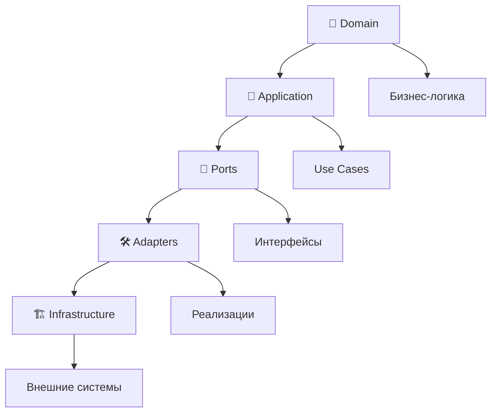
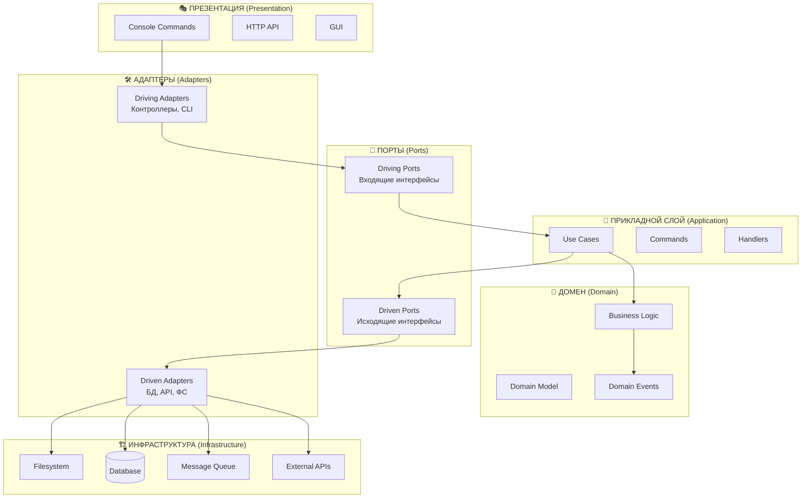
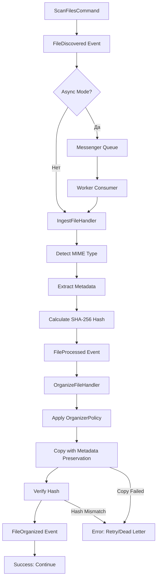
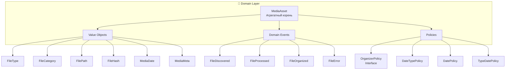
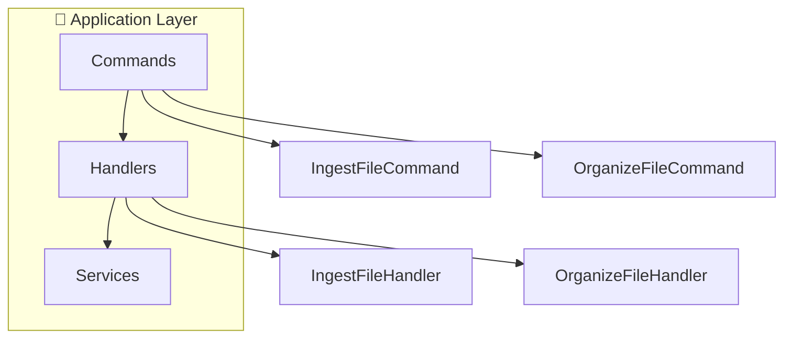
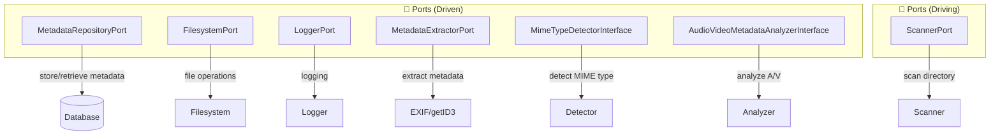
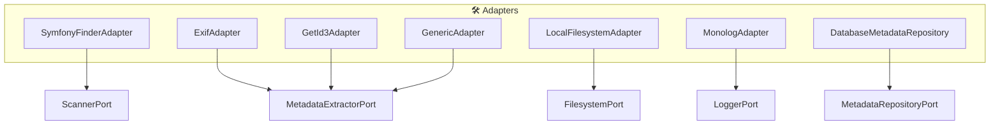
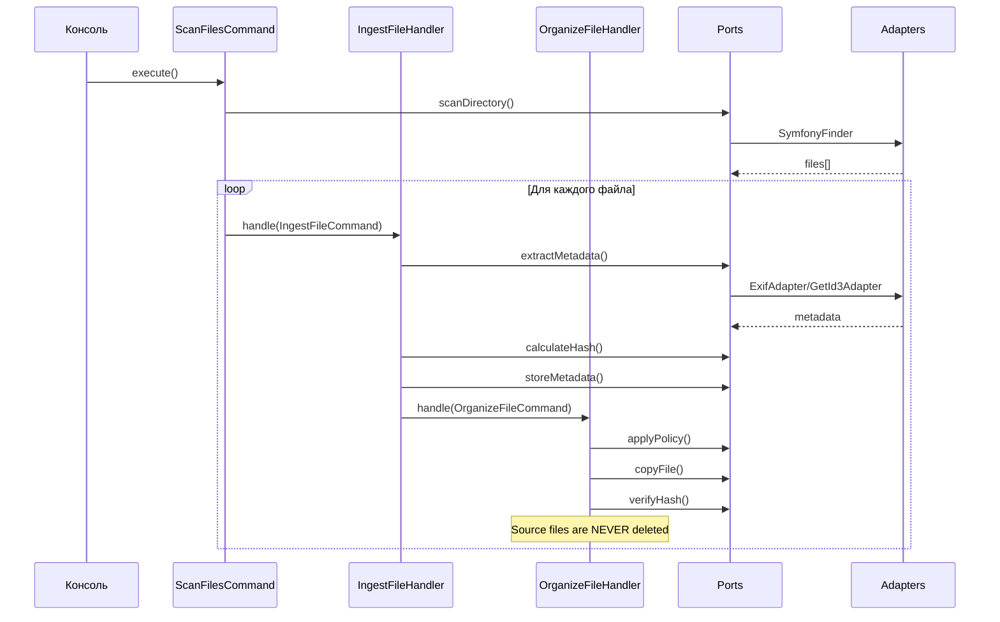
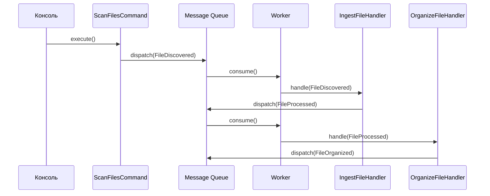
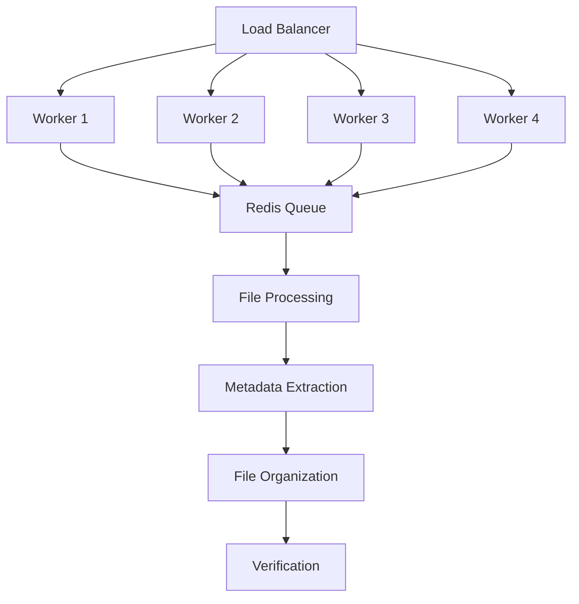

# 🏗️ Архитектура приложения Sorting Photos

## 📋 Содержание

- [🎯 Обзор архитектуры](#-обзор-архитектуры)
- [🏛️ Гексагональная архитектура (Ports & Adapters)](#️-гексагональная-архитектура-ports--adapters)
- [🔄 Pipeline обработки файлов](#-pipeline-обработки-файлов)
- [📦 Структура проекта](#-структура-проекта)
- [🎭 Слои архитектуры](#-слои-архитектуры)
- [🔌 Ports (Интерфейсы)](#-ports-интерфейсы)
- [🛠️ Adapters (Реализации)](#️-adapters-реализации)
- [🎯 Domain слой](#-domain-слой)
- [📱 Application слой](#-application-слой)
- [🏗️ Infrastructure слой](#️-infrastructure-слой)
- [🔀 Поток данных](#-поток-данных)
- [📊 Паттерны проектирования](#-паттерны-проектирования)
- [⚡ Производительность и масштабируемость](#-производительность-и-масштабируемость)

## 🎯 Обзор архитектуры

Приложение **Sorting Photos** построено на **гексагональной архитектуре (Hexagonal Architecture)**, также известной как **Ports & Adapters**. Эта архитектура обеспечивает:

- **Изоляцию домена** от внешних зависимостей
- **Легкую замену компонентов** (файловые системы, очереди, хранилища)
- **Высокую тестируемость** благодаря инверсии зависимостей
- **Масштабируемость** и поддерживаемость

### 🎯 Ключевые принципы



## 🏛️ Гексагональная архитектура (Ports & Adapters)

### 🎯 Концепция

Гексагональная архитектура представляет приложение как **шестиугольник** (гексагон), где:
- **В центре** находится **бизнес-логика (Domain)**
- **На гранях** расположены **порты (Ports)** - интерфейсы для взаимодействия с внешним миром
- **Вне гексагона** находятся **адаптеры (Adapters)** - конкретные реализации портов



### 🚀 Преимущества

- **🔄 Независимость от фреймворков** - домен не зависит от Symfony/Laravel
- **🔌 Легкая замена компонентов** - Redis ↔ RabbitMQ, SQLite ↔ PostgreSQL
- **🧪 Высокая тестируемость** - моки портов вместо реальных зависимостей
- **📈 Масштабируемость** - добавление новых адаптеров без изменения домена
- **🛡️ Защита от изменений** - внешние изменения не затрагивают бизнес-логику

## 🔄 Pipeline обработки файлов

### 📋 Обзор процесса

Обработка файлов происходит через **асинхронный pipeline** с использованием **Symfony Messenger**:



### 📊 Этапы обработки

#### 1. **Сканирование файлов** (`ScanFilesCommand` / `FileScanner`)
- **Быстрый поиск** через `FileSearcherPort` (locate/find/hybrid) для больших директорий
- **Рекурсивное сканирование** (fallback) для совместимости
- **Фильтрация** через `FilterChain` (до и после извлечения метаданных)
- Диспетчеризация событий `FileDiscovered` или создание `UploadJob`

#### 2. **Входящее сообщение** (`FileDiscovered`)
- Асинхронная обработка через Messenger
- Поддержка нескольких воркеров
- Retry policy при ошибках

#### 3. **Извлечение метаданных** (`IngestFileHandler`)
- Определение MIME-типа файла
- Извлечение метаданных (EXIF, getID3)
- Вычисление SHA-256 хеша
- Событие `FileProcessed`

#### 4. **Организация файла** (`OrganizeFileHandler`)
- Применение политики организации
- Копирование с сохранением метаданных
- Верификация целостности
- **Важно**: Исходные файлы НЕ удаляются - остаются в source директории

#### 5. **Завершение** (`FileOrganized`)
- Логирование успешной обработки
- Статистика и метрики
- Очистка временных данных

## 📦 Структура проекта

```
sorting-photos/
├── 📁 src/
│   ├── 🎯 Domain/           # Домен (бизнес-логика)
│   │   ├── MediaAsset.php   # Агрегатный корень
│   │   ├── ValueObjects/    # Value Objects
│   │   │   ├── FileType.php        # [📄](src/Domain/ValueObjects/FileType.php)
│   │   │   ├── FileCategory.php    # [📄](src/Domain/ValueObjects/FileCategory.php)
│   │   │   ├── FilePath.php        # [📄](src/Domain/ValueObjects/FilePath.php)
│   │   │   ├── FileHash.php        # [📄](src/Domain/ValueObjects/FileHash.php)
│   │   │   ├── MediaDate.php       # [📄](src/Domain/ValueObjects/MediaDate.php)
│   │   │   └── MediaMeta.php       # [📄](src/Domain/ValueObjects/MediaMeta.php)
│   │   ├── Event/                   # Доменные события
│   │   │   ├── FileDiscovered.php   # [📄](src/Domain/Event/FileDiscovered.php)
│   │   │   ├── FileProcessed.php    # [📄](src/Domain/Event/FileProcessed.php)
│   │   │   ├── FileOrganized.php    # [📄](src/Domain/Event/FileOrganized.php)
│   │   │   └── FileError.php        # [📄](src/Domain/Event/FileError.php)
│   │   └── Policies/                # Политики организации
│   │       ├── OrganizerPolicy.php  # [📄](src/Domain/Policies/OrganizerPolicy.php)
│   │       ├── DateTypePolicy.php   # [📄](src/Domain/Policies/DateTypePolicy.php)
│   │       ├── DatePolicy.php       # [📄](src/Domain/Policies/DatePolicy.php)
│   │       └── TypeDatePolicy.php   # [📄](src/Domain/Policies/TypeDatePolicy.php)
│   │
│   ├── 📱 Application/      # Прикладной слой
│   │   ├── Command/         # Команды CQRS
│   │   │   ├── IngestFileCommand.php    # [📄](src/Application/Command/IngestFileCommand.php)
│   │   │   └── OrganizeFileCommand.php  # [📄](src/Application/Command/OrganizeFileCommand.php)
│   │   └── Handler/         # Обработчики команд
│   │       ├── IngestFileHandler.php    # [📄](src/Application/Handler/IngestFileHandler.php)
│   │       └── OrganizeFileHandler.php  # [📄](src/Application/Handler/OrganizeFileHandler.php)
│   │
│   ├── 🔌 Ports/            # Интерфейсы (контракты)
│   │   ├── ScannerPort.php              # [📄](src/Ports/ScannerPort.php)
│   │   ├── MetadataExtractorPort.php    # [📄](src/Ports/MetadataExtractorPort.php)
│   │   ├── FilesystemPort.php           # [📄](src/Ports/FilesystemPort.php)
│   │   ├── LoggerPort.php               # [📄](src/Ports/LoggerPort.php)
│   │   ├── MetadataRepositoryPort.php   # [📄](src/Ports/MetadataRepositoryPort.php)
│   │   ├── MimeTypeDetectorInterface.php # [📄](src/Ports/MimeTypeDetectorInterface.php)
│   │   └── AudioVideoMetadataAnalyzerInterface.php # [📄](src/Ports/AudioVideoMetadataAnalyzerInterface.php)
│   │
│   ├── 🛠️ Adapters/         # Реализации портов
│   │   ├── Scanner/
│   │   │   └── SymfonyFinderAdapter.php        # [📄](src/Adapters/Scanner/SymfonyFinderAdapter.php)
│   │   ├── Metadata/
│   │   │   ├── ExifAdapter.php                 # [📄](src/Adapters/Metadata/ExifAdapter.php)
│   │   │   ├── GetId3Adapter.php               # [📄](src/Adapters/Metadata/GetId3Adapter.php)
│   │   │   └── GenericAdapter.php              # [📄](src/Adapters/Metadata/GenericAdapter.php)
│   │   ├── Filesystem/
│   │   │   └── LocalFilesystemAdapter.php      # [📄](src/Adapters/Filesystem/LocalFilesystemAdapter.php)
│   │   ├── Logger/
│   │   │   └── MonologAdapter.php              # [📄](src/Adapters/Logger/MonologAdapter.php)
│   │   └── Repository/
│   │       └── DatabaseMetadataRepository.php  # [📄](src/Adapters/Repository/DatabaseMetadataRepository.php)
│   │
│   └── 🏗️ Infrastructure/   # Инфраструктурный слой
│       ├── Config/
│       │   ├── ContainerFactory.php     # [📄](src/Infrastructure/Config/ContainerFactory.php)
│       │   └── ParameterResolver.php    # [📄](src/Infrastructure/Config/ParameterResolver.php)
│       ├── Helper/
│       │   ├── ByteFormatter.php        # [📄](src/Infrastructure/Helper/ByteFormatter.php)
│       │   └── DirectorySizeCalculator.php # [📄](src/Infrastructure/Helper/DirectorySizeCalculator.php)
│       ├── Messenger/
│       │   ├── FileDiscoveredHandler.php # [📄](src/Infrastructure/Messenger/FileDiscoveredHandler.php)
│       │   ├── FileProcessedHandler.php  # [📄](src/Infrastructure/Messenger/FileProcessedHandler.php)
│       │   ├── FileOrganizedHandler.php  # [📄](src/Infrastructure/Messenger/FileOrganizedHandler.php)
│       │   ├── FileErrorHandler.php      # [📄](src/Infrastructure/Messenger/FileErrorHandler.php)
│       │   ├── RetryPolicy.php           # [📄](src/Infrastructure/Messenger/RetryPolicy.php)
│       │   └── SynchronousMessageBus.php # [📄](src/Infrastructure/Messenger/SynchronousMessageBus.php)
│       ├── Filesystem/
│       │   ├── MetadataPreservingCopier.php # [📄](src/Infrastructure/Filesystem/MetadataPreservingCopier.php)
│       │   │   └── MimeTypeDetectorAdapter.php # [📄](src/Infrastructure/Filesystem/MimeTypeDetectorAdapter.php)
│       └── Metadata/
│           ├── MetadataExtractorChain.php # [📄](src/Infrastructure/Metadata/MetadataExtractorChain.php)
│           └── GetId3Adapter.php           # [📄](src/Infrastructure/Metadata/GetId3Adapter.php)
│
├── ⚙️ config/               # Конфигурация
│   ├── packages/
│   │   ├── messenger.yaml          # [📄](config/packages/messenger.yaml)
│   │   └── flysystem.yaml          # [📄](config/packages/flysystem.yaml)
│   ├── parameters.yaml             # [📄](config/parameters.yaml)
│   └── services.yaml               # [📄](config/services.yaml)
│
├── 🧪 tests/                # Тесты
│   └── src/
│       └── Unit/             # [📁](tests/src/Unit/)
│
├── 🐳 docker-compose.yml    # [📄](docker-compose.yml)
├── 🐳 Dockerfile           # [📄](Dockerfile)
├── 📋 Makefile             # [📄](Makefile)
└── 📖 docs/                # Документация
```

## 🎭 Слои архитектуры

### 🎯 Domain слой (Бизнес-логика)

**Ответственность:** Чистая бизнес-логика без зависимостей от внешнего мира.



#### MediaAsset - Агрегатный корень

```php
final readonly class MediaAsset
{
    public function __construct(
        private FilePath $sourcePath,    // Путь к файлу
        private FileType $fileType,      // Тип файла (image/video/audio/other)
        private MediaMeta $metadata,     // Метаданные файла
        private MediaDate $date,         // Дата из метаданных
        private FileHash $hash,          // SHA-256 хеш
    ) {}

    // Бизнес-методы...
    public function getCategory(): FileCategory // images/audio/video/other
    public function getFileName(): string
    public function getMimeType(): string
    public function getFileSize(): int
}
```

#### Value Objects (Неизменяемые объекты)

- **FileType** - перечисление типов файлов (image, video, audio, other)
- **FileCategory** - категории для организации (images, audio, video, other)
- **FilePath** - обертка над путем к файлу с валидацией
- **FileHash** - SHA-256 хеш файла
- **MediaDate** - дата из метаданных с приоритетами
- **MediaMeta** - метаданные файла (размер, имя, MIME-тип)

#### Domain Events (События домена)

- **FileDiscovered** - файл найден при сканировании
- **FileProcessed** - файл обработан (метаданные извлечены)
- **FileOrganized** - файл успешно организован
- **FileError** - ошибка обработки файла

#### Policies (Политики)

**OrganizerPolicy** определяет, как организовывать файлы по каталогам:

- **DateTypePolicy**: `{год}/{месяц}/{категория}/`
- **DatePolicy**: `{год}/{месяц}/`
- **TypeDatePolicy**: `{категория}/{год}/{месяц}/`

#### Search (Поиск файлов)

**FileSearchCriteria** - Value Object для критериев поиска:
- Расширения файлов
- Минимальный/максимальный размер
- Regex паттерны для имени файла
- Glob паттерны для исключения директорий/файлов
- Валидация regex паттернов при создании

### 📱 Application слой (Use Cases)

**Ответственность:** Оркестрация бизнес-процессов, CQRS команды.



#### Commands (Команды CQRS)

**IngestFileCommand** - команда на обработку файла:
```php
final readonly class IngestFileCommand
{
    public function __construct(
        private FilePath $filePath,
    ) {}

    public function getFilePath(): FilePath
}
```

**OrganizeFileCommand** - команда на организацию файла:
```php
final readonly class OrganizeFileCommand
{
    public function __construct(
        private MediaAsset $asset,
    ) {}

    public function getAsset(): MediaAsset
}
```

#### Handlers (Обработчики)

**IngestFileHandler** выполняет:
1. Определение MIME-типа
2. Извлечение метаданных (EXIF/getID3)
3. Вычисление SHA-256 хеша
4. Диспетчеризация `FileProcessed`

**OrganizeFileHandler** выполняет:
1. Применение `OrganizerPolicy`
2. Копирование с сохранением метаданных
3. Верификацию целостности
4. Удаление оригинала

### 🔌 Ports (Интерфейсы)

**Ответственность:** Определение контрактов для внешних зависимостей.



#### Driven Ports (Исходящие интерфейсы)

- **FilesystemPort** - операции с файлами
- **MetadataRepositoryPort** - хранение метаданных
- **LoggerPort** - логирование
- **MetadataExtractorPort** - извлечение метаданных
- **MimeTypeDetectorInterface** - определение MIME-типа
- **AudioVideoMetadataAnalyzerInterface** - анализ аудио/видео
- **FileSearcherPort** - быстрый поиск файлов (locate/find)

#### Driving Ports (Входящие интерфейсы)

- **ScannerPort** - сканирование директорий

### 🛠️ Adapters (Реализации)

**Ответственность:** Конкретные реализации портов для внешних систем.



#### Scanner Adapter
- **SymfonyFinderAdapter** - использует Symfony Finder для сканирования

#### Search Adapters
- **LocateSearcher** - использует команду `locate` для быстрого поиска (требует обновления базы данных)
- **FindCommandSearcher** - использует команду `find` с поддержкой параллельного поиска
- **HybridSearcher** - автоматически выбирает между `locate` и `find` с fallback

#### Metadata Adapters
- **ExifAdapter** - извлекает EXIF метаданные из изображений
- **GetId3Adapter** - анализирует аудио/видео файлы
- **GenericAdapter** - извлекает базовые метаданные (размер, дата изменения)

#### Filesystem Adapter
- **LocalFilesystemAdapter** - операции с локальной файловой системой

#### Logger Adapter
- **MonologAdapter** - интеграция с Monolog

#### Repository Adapter
- **DatabaseMetadataRepository** - хранение в SQLite/PostgreSQL

## 🔀 Поток данных

### Синхронный режим



### Асинхронный режим



## 📊 Паттерны проектирования

### 🎯 Domain-Driven Design (DDD)

- **Aggregate Root** - `MediaAsset` как корень агрегата
- **Value Objects** - неизменяемые объекты для ключевых концепций
- **Domain Events** - события бизнес-процессов
- **Repository Pattern** - абстракция хранения данных

### 📦 Hexagonal Architecture

- **Ports & Adapters** - разделение интерфейсов и реализаций
- **Dependency Inversion** - зависимости направлены наружу
- **Inversion of Control** - фреймворк управляет зависимостями

### 🔄 CQRS (Command Query Responsibility Segregation)

- **Commands** - операции изменения состояния
- **Events** - уведомления об изменениях
- **Handlers** - обработчики команд/событий

### 🏗️ Другие паттерны

- **Strategy Pattern** - политики организации файлов
- **Chain of Responsibility** - цепочка извлечения метаданных
- **Factory Pattern** - создание адаптеров
- **Observer Pattern** - обработка доменных событий

## ⚡ Производительность и масштабируемость

### 🚀 Режимы работы

#### Синхронный режим
- **Производительность**: 10-50 файлов/сек
- **Использование памяти**: ~50-100 MB
- **Рекомендация**: до 10k файлов

#### Асинхронный режим
- **Производительность**: 40-200 файлов/сек (4 воркера)
- **Использование памяти**: ~100-300 MB
- **Рекомендация**: от 10k файлов, до 2 ТБ+

### 📈 Горизонтальное масштабирование



### 🔧 Оптимизации

#### Параллельная обработка
- Несколько воркеров обрабатывают очередь параллельно
- Load balancing через message queue
- Конфигурируемое количество воркеров

#### Кеширование
- Metadata кеширование в БД
- Идемпотентность операций
- Предотвращение повторной обработки

#### Оптимизация I/O
- Batch операции с БД
- Асинхронные файловые операции
- Memory-mapped file access

### 📊 Мониторинг

- **Метрики производительности**
- **Статистика обработки**
- **Мониторинг очередей**
- **Логирование ошибок**

---

## 📚 Ссылки

- [🏠 На главную](../README.md)
- [📖 Руководство пользователя](USER_GUIDE.md)
- [☁️ Google Photos API](GOOGLE_PHOTOS_API.md)
- [🔧 Разработка](DEVELOPMENT.md)
- [🔄 Асинхронная обработка](ASYNC_PROCESSING.md)
