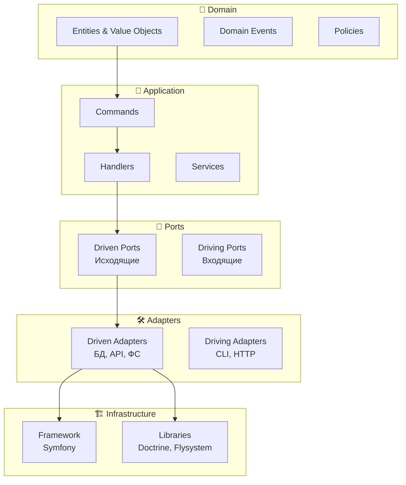

# 🔧 Разработка: Техническое руководство

Подробное техническое руководство для разработчиков, работающих с проектом Sorting Photos.

## 📋 Содержание

- [🏗️ Обзор проекта](#️-обзор-проекта)
- [🚀 Быстрый старт разработки](#-быстрый-старт-разработки)
- [📦 Структура проекта](#-структура-проекта)
- [🎯 Domain слой](#-domain-слой)
- [📱 Application слой](#-application-слой)
- [🔌 Ports и Adapters](#-ports-и-adapters)
- [🏗️ Infrastructure слой](#️-infrastructure-слой)
- [🧪 Тестирование](#-тестирование)
- [✅ Качество кода](#-качество-кода)
- [🔧 Инструменты разработки](#-инструменты-разработки)
- [📊 Профилирование и отладка](#-профилирование-и-отладка)
- [🚀 Деплоймент](#-деплоймент)
- [🤝 Contribution guidelines](#-contribution-guidelines)

## 🏗️ Обзор проекта

### 🏛️ Архитектура

**Sorting Photos** построен на **гексагональной архитектуре (Hexagonal Architecture)** с элементами **DDD (Domain-Driven Design)**:



### 🛠️ Технологический стек

| Компонент | Технология | Версия | Назначение |
|-----------|------------|--------|------------|
| **Язык** | PHP | 8.4+ | Основной язык |
| **Фреймворк** | Symfony | 7.x | DI, Console, Messenger |
| **База данных** | SQLite | 3.x | Метаданные (по умолчанию) |
| **Очереди** | Redis/RabbitMQ | latest | Асинхронная обработка |
| **Хранение** | Flysystem | 3.x | Абстракция файловой системы |
| **API клиент** | Guzzle | 7.x | HTTP запросы |
| **Метаданные** | getID3 | 2.x | Извлечение медиа-метаданных |
| **Тестирование** | PHPUnit | 9.x | Unit и integration тесты |
| **Качество** | PHPStan | 2.x | Статический анализ |
| **CS** | PHP-CS-Fixer | 3.x | Стиль кода |

## 🚀 Быстрый старт разработки

### 📋 Системные требования

```bash
# PHP 8.4+
php --version

# Composer 2.0+
composer --version

# Docker (рекомендуется)
docker --version
docker compose version

# Git
git --version
```

### 🏃‍♂️ Настройка окружения

#### 1. Клонирование и установка

```bash
# Клонировать
git clone <repository-url>
cd sorting-photos

# Установить зависимости
composer install

# Настройка прав доступа
mkdir -p var/data/source var/data/destination
chmod 755 var/data/source var/data/destination
```

#### 2. Docker окружение (рекомендуется)

```bash
# Инициализация
make data-init

# Запуск
make up

# Вход в контейнер
make shell
```

#### 3. Локальное окружение

```bash
# Создание .env
cp .env.example .env

# Настройка путей
nano .env
```

```bash
# .env для локальной разработки
SOURCE_DIRECTORY=/home/user/Pictures
DESTINATION_DIRECTORY=/home/user/Sorted
MESSENGER_TRANSPORT_DSN=redis://localhost:6379/messages
```

#### 4. Проверка установки

```bash
# Тесты
make test

# Качество кода
make qa

# Функциональный тест
make organize-files-dry-run
```

## 📦 Структура проекта

### 📁 Полная структура

```
sorting-photos/
├── 📄 composer.json                    # Зависимости PHP
├── 📄 composer.lock                    # Lock файл
├── 🐳 Dockerfile                       # Docker образ
├── 🐳 docker-compose.yml               # Docker Compose
├── 📋 Makefile                         # Команды сборки
├── 📖 README.md                        # Документация
├── 📖 docs/                            # Подробная документация
│
├── 📁 src/                             # Исходный код
│   ├── 🎯 Domain/                      # Домен (бизнес-логика)
│   │   ├── MediaAsset.php              # Агрегатный корень
│   │   ├── ValueObjects/               # Value Objects
│   │   ├── Event/                      # Доменные события
│   │   └── Policies/                   # Политики
│   │
│   ├── 📱 Application/                 # Прикладной слой
│   │   ├── Command/                    # CQRS команды
│   │   ├── Handler/                    # Обработчики команд
│   │   └── Service/                    # Сервисы оркестрации
│   │
│   ├── 🔌 Ports/                       # Интерфейсы (контракты)
│   │   ├── ScannerPort.php
│   │   ├── FilesystemPort.php
│   │   └── MetadataRepositoryPort.php
│   │
│   ├── 🛠️ Adapters/                    # Реализации портов
│   │   ├── Scanner/
│   │   │   └── SymfonyFinderAdapter.php
│   │   ├── Filesystem/
│   │   │   └── LocalFilesystemAdapter.php
│   │   └── Repository/
│   │       └── DatabaseMetadataRepository.php
│   │
│   ├── 🏗️ Infrastructure/              # Инфраструктура
│   │   ├── Config/                     # Конфигурация
│   │   ├── Messenger/                  # Очереди
│   │   ├── Filesystem/                 # Файловые операции
│   │   └── Metadata/                   # Метаданные
│   │
│   └── ⚙️ Command/                     # Консольные команды
│       ├── OrganizeFilesCommand.php
│       └── ScanFilesCommand.php
│
├── ⚙️ config/                          # Конфигурация Symfony
│   ├── packages/                       # Пакетная конфигурация
│   │   ├── messenger.yaml
│   │   └── flysystem.yaml
│   ├── parameters.yaml                 # Параметры
│   └── services.yaml                   # DI контейнер
│
├── 🧪 tests/                           # Тесты
│   ├── Unit/                           # Unit тесты
│   └── Integration/                    # Integration тесты
│
├── 📊 var/                             # Переменные данные
│   ├── cache/                          # Кеш
│   ├── log/                            # Логи
│   ├── database.sqlite                 # БД метаданных
│   └── data/                           # Рабочие директории
│       ├── source/                     # Исходные файлы
│       └── destination/                # Результат
│
├── 🔧 bin/                             # Исполняемые файлы
│   └── console                         # Symfony Console
│
├── 📋 phpunit.xml                      # Конфигурация PHPUnit
├── 📋 phpstan.neon                     # Конфигурация PHPStan
├── 📋 psalm.xml                        # Конфигурация Psalm
└── 📋 rector.php                       # Конфигурация Rector
```

### 📋 Ключевые файлы

| Файл | Назначение |
|------|------------|
| `composer.json` | Зависимости и автозагрузка |
| `docker-compose.yml` | Определение сервисов |
| `Makefile` | Команды сборки и развертывания |
| `src/Domain/MediaAsset.php` | Центральная доменная модель |
| `config/services.yaml` | Конфигурация DI контейнера |
| `phpunit.xml` | Настройки тестирования |

## 🎯 Domain слой

### 📋 Entities и Value Objects

#### MediaAsset - Агрегатный корень

```php
<?php
declare(strict_types=1);

namespace SortingPhotosByDate\Domain;

final readonly class MediaAsset
{
    public function __construct(
        private FilePath $sourcePath,      // Путь к файлу
        private FileType $fileType,        // Тип файла
        private MediaMeta $metadata,       // Метаданные
        private MediaDate $date,           // Дата из метаданных
        private FileHash $hash,            // SHA-256 хеш
    ) {}

    public function getCategory(): FileCategory
    {
        return $this->fileType->toCategory();
    }

    public function getFileName(): string
    {
        return $this->metadata->getFileName();
    }
}
```

#### Value Objects

```php
// FilePath - обертка над путем с валидацией
final readonly class FilePath
{
    public function __construct(string $path)
    {
        if (!file_exists($path)) {
            throw new InvalidFilePathException($path);
        }
        $this->path = $path;
    }
}

// MediaDate - дата с приоритетами источников
final readonly class MediaDate
{
    public function __construct(
        private ?\DateTimeImmutable $exifDateTimeOriginal = null,
        private ?\DateTimeImmutable $exifDateTime = null,
        private ?\DateTimeImmutable $fileMtime = null,
    ) {}

    public function getBestDate(): \DateTimeImmutable
    {
        return $this->exifDateTimeOriginal
            ?? $this->exifDateTime
            ?? $this->fileMtime
            ?? throw new NoDateAvailableException();
    }
}
```

### 🎯 Domain Events

```php
// События домена
final readonly class FileDiscovered
{
    public function __construct(
        public FilePath $filePath,
        public int $fileSize,
    ) {}
}

final readonly class FileProcessed
{
    public function __construct(
        public MediaAsset $asset,
        public \DateTimeImmutable $processedAt,
    ) {}
}

final readonly class FileOrganized
{
    public function __construct(
        public MediaAsset $asset,
        public FilePath $destinationPath,
        public \DateTimeImmutable $organizedAt,
    ) {}
}
```

### 📋 Policies (Политики)

#### OrganizerPolicy - стратегия организации

```php
interface OrganizerPolicy
{
    public function organize(MediaAsset $asset): FilePath;
}

// Конкретные реализации
final readonly class DateTypePolicy implements OrganizerPolicy
{
    public function __construct(private string $baseDirectory) {}

    public function organize(MediaAsset $asset): FilePath
    {
        $year = $asset->getDate()->getYear();
        $month = str_pad((string) $asset->getDate()->getMonth(), 2, '0', STR_PAD_LEFT);
        $category = $asset->getCategory()->value;

        $path = sprintf(
            '%s/%d/%s/%s/%s',
            $this->baseDirectory,
            $year,
            $month,
            $category,
            $asset->getFileName()
        );

        return new FilePath($path);
    }
}
```

## 📱 Application слой

### 📋 CQRS Commands

```php
// Команды - намерения изменения состояния
final readonly class IngestFileCommand
{
    public function __construct(private FilePath $filePath) {}
    public function getFilePath(): FilePath { return $this->filePath; }
}

final readonly class OrganizeFileCommand
{
    public function __construct(private MediaAsset $asset) {}
    public function getAsset(): MediaAsset { return $this->asset; }
}
```

### 🔄 Handlers

```php
final readonly class IngestFileHandler
{
    public function __construct(
        private MimeTypeDetectorInterface $mimeDetector,
        private MetadataExtractorPort $metadataExtractor,
        private HasherInterface $hasher,
        private MetadataRepositoryPort $repository,
    ) {}

    public function handle(IngestFileCommand $command): void
    {
        $filePath = $command->getFilePath();

        // Определение MIME типа
        $mimeType = $this->mimeDetector->detectMimeType($filePath);

        // Извлечение метаданных
        $metadata = $this->metadataExtractor->extract($filePath);

        // Вычисление хеша
        $hash = $this->hasher->hash(FileContent::fromPath($filePath));

        // Создание MediaAsset
        $asset = new MediaAsset(
            $filePath,
            FileType::fromMimeType($mimeType),
            $metadata,
            MediaDate::fromMetadata($metadata),
            $hash
        );

        // Сохранение метаданных
        $this->repository->save(new MediaAssetEntity($asset));

        // Диспетчеризация события
        $this->eventDispatcher->dispatch(new FileProcessed($asset));
    }
}
```

## 🔌 Ports и Adapters

### 📋 Ports (Интерфейсы)

```php
// Driven Ports - исходящие зависимости
interface FilesystemPort
{
    public function read(FilePath $path): FileContent;
    public function write(FilePath $path, FileContent $content): void;
    public function copy(FilePath $source, FilePath $destination): void;
    public function delete(FilePath $path): void;
    public function exists(FilePath $path): bool;
}

interface MetadataRepositoryPort
{
    public function findByPath(FilePath $path): ?MediaAssetEntity;
    public function save(MediaAssetEntity $entity): void;
    public function findProcessedSince(\DateTimeImmutable $since): array;
}

// Driving Ports - входящие интерфейсы
interface ScannerPort
{
    /**
     * @return iterable<FilePath>
     */
    public function scan(DirectoryPath $directory): iterable;
}
```

### 🛠️ Adapters (Реализации)

#### Filesystem Adapter

```php
final readonly class LocalFilesystemAdapter implements FilesystemPort
{
    public function __construct(private FlysystemFilesystem $filesystem) {}

    public function read(FilePath $path): FileContent
    {
        try {
            $content = $this->filesystem->read($path->toString());
            return FileContent::fromString($content);
        } catch (FilesystemException $e) {
            throw new FilesystemReadException($path, $e);
        }
    }

    public function copy(FilePath $source, FilePath $destination): void
    {
        try {
            $this->filesystem->copy(
                $source->toString(),
                $destination->toString()
            );
        } catch (FilesystemException $e) {
            throw new FilesystemCopyException($source, $destination, $e);
        }
    }
}
```

#### Repository Adapter

```php
final readonly class DatabaseMetadataRepository implements MetadataRepositoryPort
{
    public function __construct(private Connection $connection) {}

    public function save(MediaAssetEntity $entity): void
    {
        $this->connection->executeStatement(
            'INSERT OR REPLACE INTO media_assets (path, hash, size, metadata) VALUES (?, ?, ?, ?)',
            [
                $entity->getPath()->toString(),
                $entity->getHash()->toString(),
                $entity->getSize(),
                json_encode($entity->getMetadata()),
            ]
        );
    }
}
```

## 🏗️ Infrastructure слой

### ⚙️ Configuration

#### services.yaml

```yaml
services:
    # Domain Services
    SortingPhotosByDate\Domain\Policies\DateTypePolicy:
        arguments:
            $baseDirectory: '%app.destination_directory%'

    # Application Services
    SortingPhotosByDate\Application\Handler\IngestFileHandler:
        arguments:
            $mimeDetector: '@mime_type_detector'
            $metadataExtractor: '@metadata_extractor_chain'
            $hasher: '@file_hasher'
            $repository: '@metadata_repository'
        tags: ['messenger.message_handler']

    # Ports (interfaces)
    SortingPhotosByDate\Ports\FilesystemPort: '@filesystem_adapter'
    SortingPhotosByDate\Ports\MetadataRepositoryPort: '@metadata_repository'

    # Adapters (implementations)
    filesystem_adapter:
        class: SortingPhotosByDate\Adapters\Filesystem\LocalFilesystemAdapter
        arguments:
            $filesystem: '@flysystem.local'

    metadata_repository:
        class: SortingPhotosByDate\Adapters\Repository\DatabaseMetadataRepository
        arguments:
            $connection: '@doctrine.dbal.default_connection'
```

#### parameters.yaml

```yaml
parameters:
    # Application parameters (overridden by env via ParameterResolver)
    app.source_directory: ''
    app.destination_directory: ''
    app.source_directory_host: ''
    app.destination_directory_host: ''
    app.organizer_policy: 'date-type'
    app.dry_run: false

    # Filesystem parameters
    app.filesystem.default_dir_permissions: 493  # 0755 в десятичном

    # Google Photos API
    app.google_photos.access_token: ''
    app.google_photos.album_id: null
    app.google_photos.credentials_path: ''
    app.google_photos.full_access: false

    # Compression
    app.compression.enabled: false
    app.compression.jpeg_max_pixels: 75000000
    app.compression.png_max_pixels: 200000000
    app.compression.video_max_size_bytes: 10737418240

    # Google Photos (доп. параметры)
    google_photos.compression.enabled: true
    google_photos.compression.quality: 95
    google_photos.compression.max_width: 4096
    google_photos.compression.max_height: 4096
    google_photos.compression.format: 'auto'
    google_photos.compression.conditions.min_file_size: '1MB'
    google_photos.compression.conditions.max_compression_ratio: 0.8
    google_photos.upload.chunk_size: 262144
    google_photos.upload.max_retries: 3
    google_photos.upload.retry_delay: 1000
    google_photos.batch.size: 50
    google_photos.batch.timeout: 30
    google_photos.quota.daily_upload: '1000GB'
    google_photos.quota.hourly_upload: '100GB'
    google_photos.quota.requests_per_minute: 60
    google_photos.quota.burst_limit: 100
    google_photos.metrics.enabled: false
    google_photos.monitoring.health_check_interval: '60s'
    google_photos.monitoring.alert_on_quota_exceeded: false
```

Примечание: значения из `parameters.yaml` могут быть переопределены переменными окружения через `ParameterResolver` (см. `src/Infrastructure/Config/ParameterResolver.php`). Для обязательных путей (`SOURCE_DIRECTORY`, `DESTINATION_DIRECTORY`) переопределение применяется только если переменная окружения непуста.

### 🔄 Messenger (Очереди)

#### Конфигурация очередей

```yaml
# config/packages/messenger.yaml
framework:
    messenger:
        transports:
            async: '%env(MESSENGER_TRANSPORT_DSN)%'
            failed: 'doctrine://default?queue_name=failed'

        routing:
            SortingPhotosByDate\Domain\Event\FileDiscovered: async
            SortingPhotosByDate\Domain\Event\FileProcessed: async
```

#### Retry политика

```yaml
framework:
    messenger:
        transports:
            async:
                dsn: '%env(MESSENGER_TRANSPORT_DSN)%'
                retry_strategy:
                    max_retries: 3
                    delay: 1000
                    multiplier: 2
                    max_delay: 10000
```

### 📊 Statistics и Monitoring

```php
final readonly class ProcessingStatistics
{
    public function __construct(
        private StatisticsRepository $repository,
        private Clock $clock,
    ) {}

    public function recordFileProcessed(MediaAsset $asset, \DateTimeImmutable $processedAt): void
    {
        $this->repository->incrementCounter('files_processed');
        $this->repository->recordMetric('processing_time', $processedAt->diff($asset->getCreatedAt()));
        $this->repository->recordFileSize($asset->getFileSize());
    }

    public function getStatistics(): ProcessingStats
    {
        return new ProcessingStats(
            totalFiles: $this->repository->getCounter('files_processed'),
            totalSize: $this->repository->getTotalSize(),
            averageProcessingTime: $this->repository->getAverageMetric('processing_time'),
            startTime: $this->repository->getStartTime(),
        );
    }
}
```

## 🧪 Тестирование

### 📋 Структура тестов

```
tests/
├── Unit/                              # Unit тесты
│   ├── Domain/                       # Домен
│   │   ├── MediaAssetTest.php
│   │   ├── ValueObjects/
│   │   └── Policies/
│   ├── Application/                  # Прикладной слой
│   │   ├── Command/
│   │   └── Handler/
│   └── Infrastructure/               # Инфраструктура
│       ├── Config/
│       └── Helper/
├── Integration/                      # Integration тесты
│   ├── DatabaseMetadataRepositoryTest.php
│   └── LocalFilesystemAdapterTest.php
└── E2E/                              # End-to-end тесты
    └── FileOrganizationWorkflowTest.php
```

### 🧪 Unit тесты

#### Тест домена

```php
<?php
declare(strict_types=1);

namespace SortingPhotosByDate\Tests\Unit\Domain;

use PHPUnit\Framework\TestCase;
use SortingPhotosByDate\Domain\MediaAsset;
use SortingPhotosByDate\Domain\ValueObjects\FilePath;
use SortingPhotosByDate\Domain\ValueObjects\FileType;

class MediaAssetTest extends TestCase
{
    public function testCreatesMediaAssetWithValidData(): void
    {
        $filePath = new FilePath('/tmp/test.jpg');
        $fileType = FileType::Image;
        $metadata = $this->createMock(MediaMeta::class);
        $date = $this->createMock(MediaDate::class);
        $hash = $this->createMock(FileHash::class);

        $asset = new MediaAsset($filePath, $fileType, $metadata, $date, $hash);

        self::assertSame($filePath, $asset->getSourcePath());
        self::assertSame($fileType, $asset->getFileType());
        self::assertSame(FileCategory::Images, $asset->getCategory());
    }

    public function testThrowsExceptionForInvalidFilePath(): void
    {
        $this->expectException(InvalidFilePathException::class);
        new FilePath('/nonexistent/file.jpg');
    }
}
```

#### Тест с данными

```php
class DateTypePolicyTest extends TestCase
{
    /**
     * @dataProvider organizationExamples
     */
    public function testOrganizesFilesByDateAndType(
        MediaAsset $asset,
        string $expectedPath
    ): void {
        $policy = new DateTypePolicy('/destination');

        $result = $policy->organize($asset);

        self::assertSame($expectedPath, $result->toString());
    }

    public function organizationExamples(): iterable
    {
        yield 'Image from 2023-07' => [
            $this->createAsset('photo.jpg', FileType::Image, '2023-07-15'),
            '/destination/2023/07/images/photo.jpg'
        ];

        yield 'Video from 2024-01' => [
            $this->createAsset('video.mp4', FileType::Video, '2024-01-20'),
            '/destination/2024/01/video/video.mp4'
        ];
    }
}
```

### 🔄 Integration тесты

```php
class DatabaseMetadataRepositoryTest extends TestCase
{
    private Connection $connection;
    private DatabaseMetadataRepository $repository;

    protected function setUp(): void
    {
        $this->connection = DriverManager::getConnection([
            'driver' => 'pdo_sqlite',
            'memory' => true,
        ]);

        $this->createSchema($this->connection);
        $this->repository = new DatabaseMetadataRepository($this->connection);
    }

    public function testSavesAndRetrievesMediaAsset(): void
    {
        $entity = new MediaAssetEntity(/* ... */);

        $this->repository->save($entity);
        $retrieved = $this->repository->findByPath($entity->getPath());

        self::assertNotNull($retrieved);
        self::assertEquals($entity, $retrieved);
    }
}
```

### 🚀 Запуск тестов

```bash
# Все тесты
make test

# С покрытием
make test-coverage

# Конкретный тест
make test-filter TEST=MediaAssetTest

# Integration тесты
make test-integration

# С параллельным запуском
./vendor/bin/phpunit --parallel
```

## ✅ Качество кода

### 📋 Инструменты

#### PHPStan - статический анализ

```neon
# phpstan.neon
parameters:
    level: 8
    paths:
        - src
    excludePaths:
        - src/Infrastructure/Config/ContainerFactory.php
    ignoreErrors:
        - '#Call to an undefined method#'
```

#### Psalm - дополнительный статический анализ

```xml
<!-- psalm.xml -->
<psalm
    errorLevel="4"
    resolveFromConfigFile="true"
    xmlns:xsi="http://www.w3.org/2001/XMLSchema-instance"
    xmlns="https://getpsalm.org/schema/config"
    xsi:schemaLocation="https://getpsalm.org/schema/config vendor/vimeo/psalm/config.xsd"
>
    <projectFiles>
        <directory name="src" />
    </projectFiles>
</psalm>
```

#### PHP-CS-Fixer - стиль кода

```php
// .php-cs-fixer.dist.php
$config = new PhpCsFixer\Config();
return $config
    ->setRules([
        '@PSR12' => true,
        '@Symfony' => true,
        'declare_strict_types' => true,
        'strict_param' => true,
        'array_syntax' => ['syntax' => 'short'],
    ])
    ->setFinder(
        PhpCsFixer\Finder::create()
            ->in(__DIR__ . '/src')
            ->in(__DIR__ . '/tests')
    );
```

### 🔧 Запуск проверки качества

```bash
# PHPStan
make phpstan

# Psalm
make psalm

# PHP-CS-Fixer
make cs-fix

# Все проверки
make qa

# GrumPHP (pre-commit hooks)
make grumphp
```

## 🔧 Инструменты разработки

### 📋 Makefile команды

```makefile
# Docker
up: ## Запуск приложения
down: ## Остановка
shell: ## Вход в контейнер

# Приложение
run: ## Синхронная обработка
run-dry-run: ## Пробный запуск
consume: ## Запуск воркера

# Качество
test: ## Запуск тестов
qa: ## Все проверки качества
cs-fix: ## Исправление стиля кода

# Google Photos
google-photos-authorize: ## Авторизация
google-photos-test: ## Тестирование API
google-photos-upload: ## Загрузка файлов
```

### 🔍 Отладка

#### Xdebug в Docker

```yaml
# docker-compose.yml
services:
  app:
    build:
      context: .
      dockerfile: Dockerfile
    environment:
      - XDEBUG_MODE=debug
      - XDEBUG_CONFIG=client_host=host.docker.internal
    ports:
      - "9003:9003"  # Xdebug порт
```

#### Логирование

```php
// Детальное логирование
$logger = $this->logger;
$logger->debug('Processing file', [
    'file' => $filePath->toString(),
    'size' => $metadata->getFileSize(),
    'mime' => $metadata->getMimeType(),
]);
```

#### Profiling

```bash
# Blackfire
blackfire run php bin/console organize:files

# XHProf
# Добавьте в код:
xhprof_enable(XHPROF_FLAGS_CPU | XHPROF_FLAGS_MEMORY);
# ... код ...
$data = xhprof_disable();
```

## 📊 Профилирование и отладка

### 📈 Метрики производительности

```php
final readonly class PerformanceMonitor
{
    public function __construct(
        private Stopwatch $stopwatch,
        private LoggerInterface $logger,
    ) {}

    public function measure(string $operation, callable $callback): mixed
    {
        $this->stopwatch->start($operation);

        try {
            $result = $callback();
            return $result;
        } finally {
            $duration = $this->stopwatch->stop($operation);

            $this->logger->info('Operation completed', [
                'operation' => $operation,
                'duration_ms' => $duration->getDuration(),
                'memory_peak' => $duration->getMemory(),
            ]);
        }
    }
}
```

### 🔍 Memory profiling

```bash
# Проверить потребление памяти
php -r "
$before = memory_get_peak_usage();
require 'vendor/autoload.php';
// ... код ...
$after = memory_get_peak_usage();
echo 'Memory used: ' . (($after - $before) / 1024 / 1024) . ' MB' . PHP_EOL;
"
```

### 📋 Database profiling

```yaml
# doctrine.yaml
doctrine:
    dbal:
        connections:
            default:
                logging: '%kernel.debug%'
                profiling: '%kernel.debug%'
```

## 🚀 Деплоймент

### 🐳 Production Docker

```dockerfile
# Dockerfile.prod
FROM php:8.4-fpm-alpine

# Multi-stage build для оптимизации
COPY --from=builder /app/vendor /app/vendor
COPY --from=builder /app/src /app/src

# Production конфигурация
ENV APP_ENV=prod
ENV APP_DEBUG=0

# Оптимизация
RUN composer install --optimize-autoloader --no-dev
RUN php bin/console cache:warmup
```

### ⚙️ Production конфигурация

```yaml
# config/packages/prod/messenger.yaml
framework:
    messenger:
        transports:
            async: '%env(RABBITMQ_DSN)%'
            failed: 'doctrine://default?queue_name=dead_letter'
```

### 📊 Мониторинг

```yaml
# Мониторинг очередей
framework:
    messenger:
        transports:
            async:
                dsn: '%env(RABBITMQ_DSN)%'
                failure_transport: failed
                retry_strategy:
                    max_retries: 5
                    delay: 1000
                    multiplier: 2
```

## 🤝 Contribution guidelines

### 📋 Процесс contribution

1. **Fork** репозиторий
2. **Создать** feature branch: `git checkout -b feature/new-feature`
3. **Написать** тесты для новой функциональности
4. **Реализовать** функциональность
5. **Запустить** все тесты: `make qa`
6. **Создать** Pull Request

### 📝 Требования к коду

#### Стиль кода
- PSR-12 coding standard
- Обязательные declare(strict_types=1)
- Типизированные свойства и параметры
- Final классы и readonly свойства

#### Тестирование
- 100% покрытие новыми классами
- Integration тесты для инфраструктуры
- E2E тесты для критических сценариев

#### Документация
- PHPDoc для всех public методов
- Описание сложной бизнес-логики
- Обновление README при изменении API

#### Commit messages
```
feat: add resumable upload for large files

- Implement chunked upload mechanism
- Add progress tracking
- Handle session expiration
- Add comprehensive tests

Closes #123
```

### 🔄 Code Review checklist

- [ ] Архитектура соответствует гексагональной
- [ ] Domain слой изолирован от инфраструктуры
- [ ] Все публичные методы типизированы
- [ ] Добавлены соответствующие тесты
- [ ] Код соответствует PSR-12
- [ ] Добавлена документация
- [ ] Нет прямых зависимостей от фреймворка в Domain

---

## 📚 Ссылки

- [🏠 На главную](../README.md)
- [📖 Руководство пользователя](USER_GUIDE.md)
- [🏗️ Архитектура](ARCHITECTURE.md)
- [☁️ Google Photos API](GOOGLE_PHOTOS_API.md)
- [🔄 Асинхронная обработка](ASYNC_PROCESSING.md)
- [📊 Мониторинг](MONITORING.md)

## 🔗 Полезные ссылки

- [PHP 8.4 Features](https://php.net/releases/8.4/en.php)
- [Symfony Documentation](https://symfony.com/doc/current/index.html)
- [Hexagonal Architecture](https://alistair.cockburn.us/hexagonal-architecture/)
- [DDD Reference](https://domainlanguage.com/ddd/reference/)
- [CQRS Pattern](https://martinfowler.com/bliki/CQRS.html)
