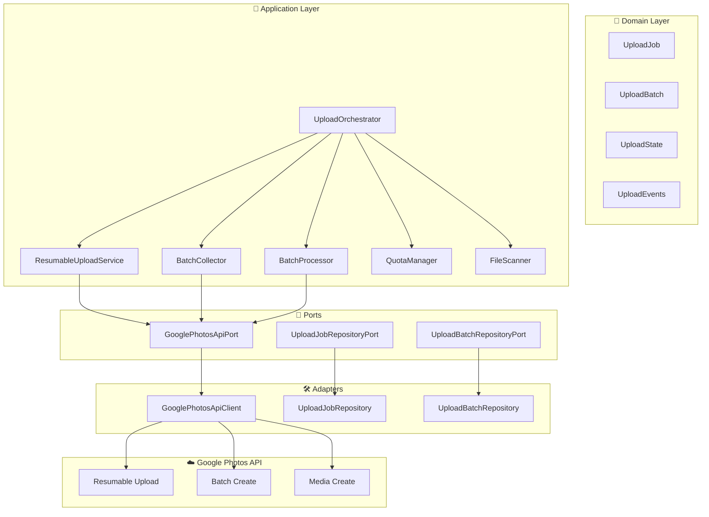
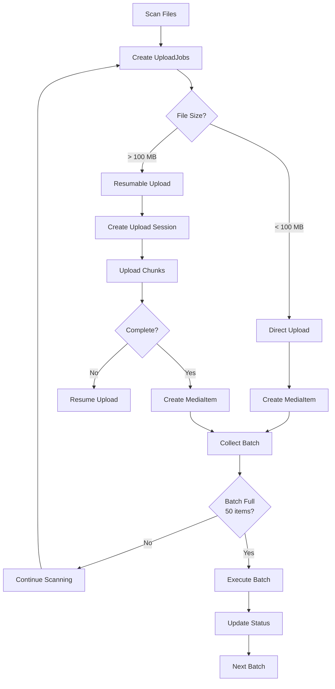
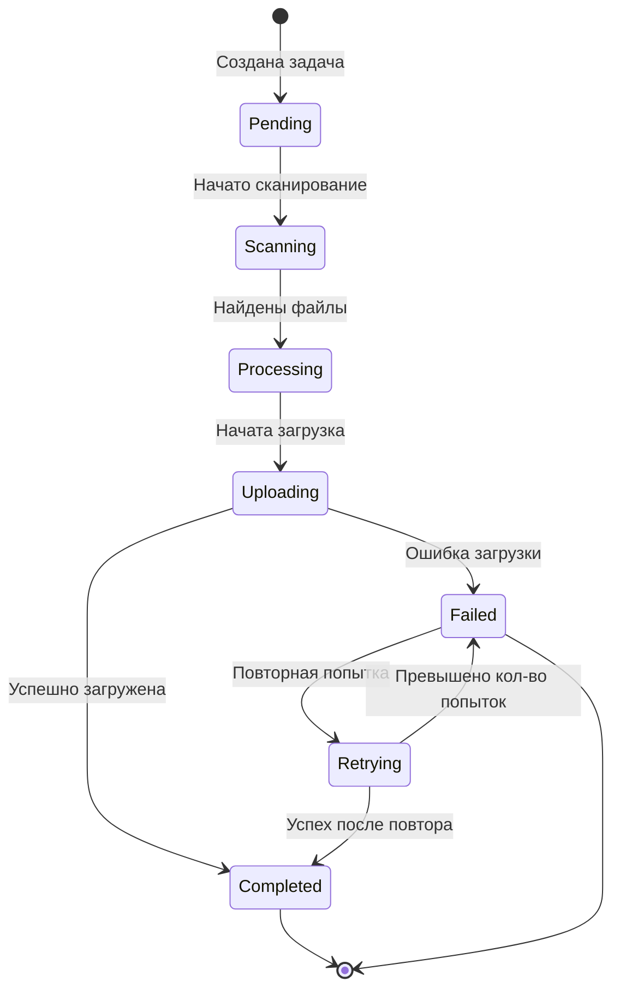
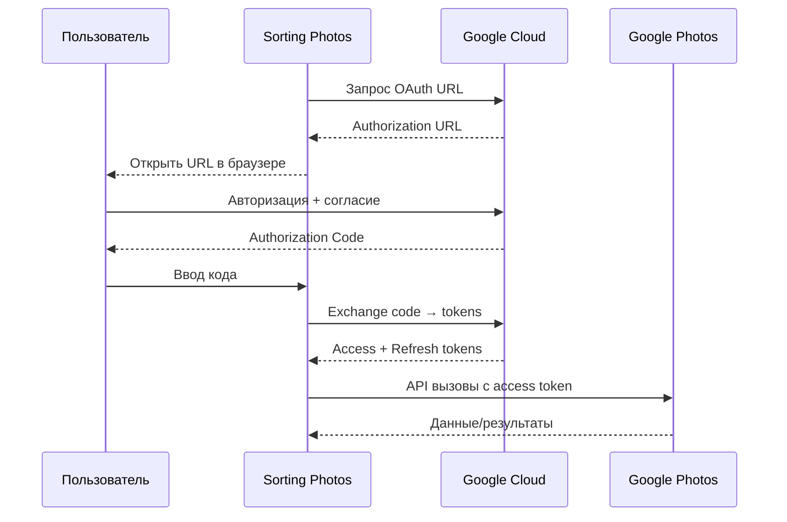
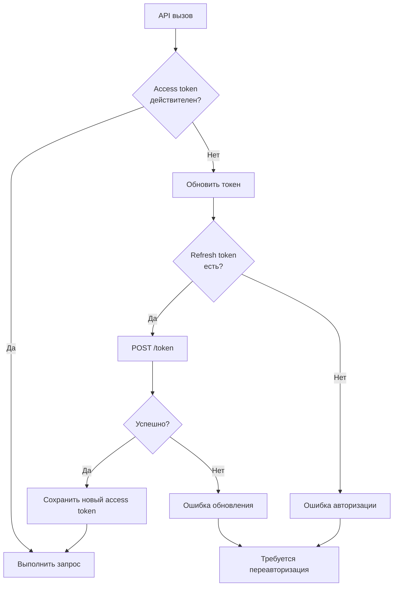
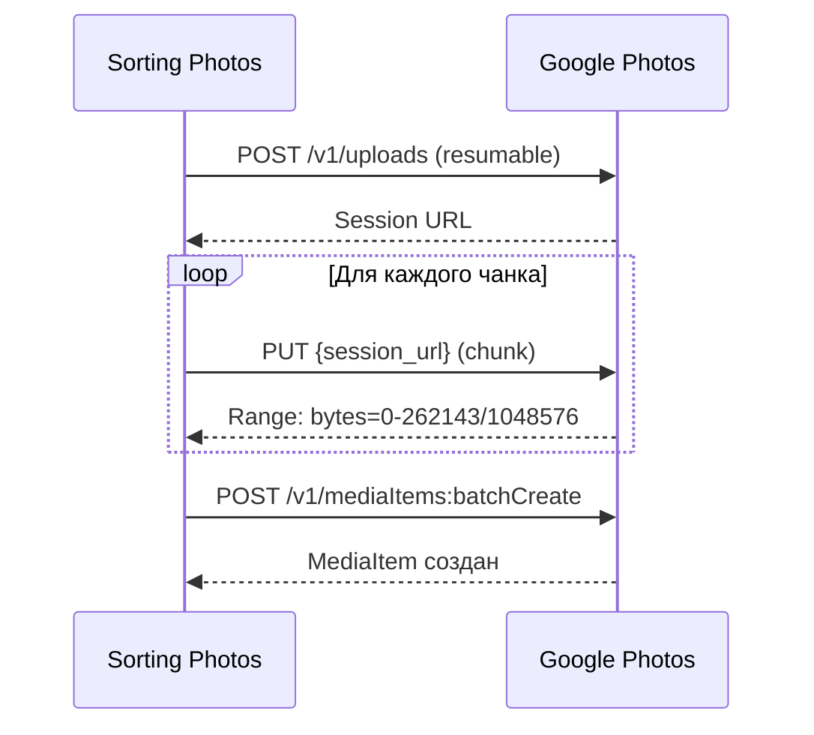
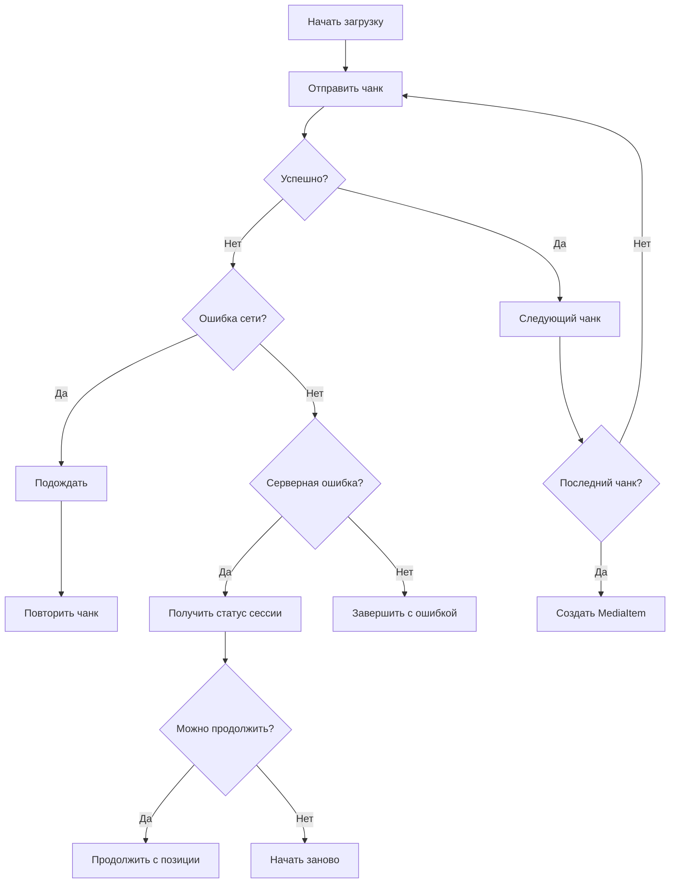
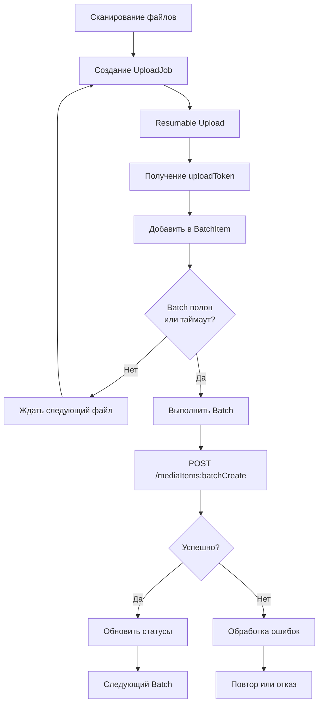
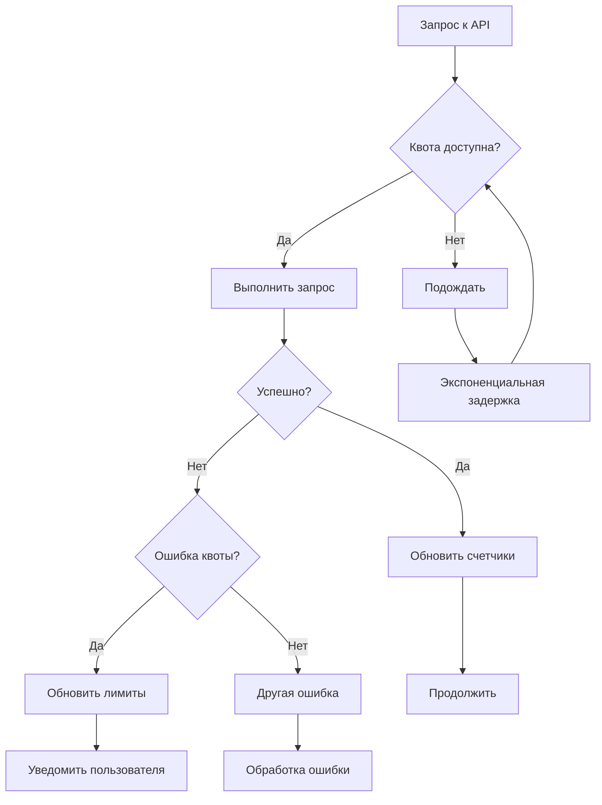
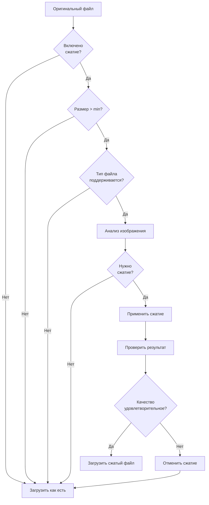

# ☁️ Google Photos API: Интеграция и загрузка

Подробное руководство по настройке и использованию интеграции с Google Photos API для автоматической загрузки фотографий и видео.

## 📋 Содержание

- [🎯 Обзор](#-обзор)
- [🏗️ Архитектура интеграции](#️-архитектура-интеграции)
- [🚀 Настройка Google Cloud](#-настройка-google-cloud)
- [🔐 OAuth 2.0 Авторизация](#-oauth-20-авторизация)
- [⚙️ Конфигурация приложения](#️-конфигурация-приложения)
- [📤 Загрузка файлов](#-загрузка-файлов)
- [🔄 Resumable Upload](#-resumable-upload)
- [📦 Batch Processing](#-batch-processing)
- [📊 Управление квотами](#-управление-квотами)
- [🗜️ Сжатие изображений](#️-сжатие-изображений)
- [📈 Мониторинг и отладка](#-мониторинг-и-отладка)
- [🐛 Решение проблем](#-решение-проблем)
- [🔧 Расширенная настройка](#-расширенная-настройка)

## 🎯 Обзор

### 🚀 Возможности

- 📤 **Масштабная загрузка**: До 2 ТБ+ фотографий и видео
- ⏱️ **Resumable Upload**: Продолжение загрузки после прерываний
- 📦 **Batch Processing**: Пакетная загрузка до 50 элементов
- 📊 **Управление квотами**: Автоматическое соблюдение API лимитов
- 🗜️ **Сжатие**: Оптимизация изображений без потери качества
- 🔄 **Идемпотентность**: Безопасные повторные запуски
- 📅 **Хронология**: Точные даты из метаданных

### 🎯 Use Cases

#### Первичная миграция
```
С локального диска → Google Photos
     ↓
✅ Полная загрузка с правильной хронологией
✅ Сохранение метаданных
✅ Продолжение после сбоев
```

#### Синхронизация
```
Регулярные загрузки → Google Photos
     ↓
✅ Только новые файлы
✅ Проверка дубликатов
✅ Управление квотами
```

#### Архивация
```
Внешние диски → Google Photos
     ↓
✅ Загрузка больших объемов
✅ Batch processing
✅ Мониторинг прогресса
```

## 🏗️ Архитектура интеграции

### 📦 Основные компоненты



### 🔄 Процесс загрузки



### 📊 Состояния загрузки



## 🚀 Настройка Google Cloud

### 📋 Предварительные требования

- ✅ Google аккаунт
- ✅ Доступ к Google Cloud Console
- ✅ Проект в Google Cloud (бесплатно)

### 🛠️ Шаг 1: Создание проекта

1. **Перейдите в [Google Cloud Console](https://console.cloud.google.com/)**
2. **Создайте новый проект**
   - Нажмите "Создать проект"
   - Название: `sorting-photos-{username}`
   - Организация: оставьте пустым (для бесплатного тарифа)

3. **Выберите проект** в верхнем меню

### 🔑 Шаг 2: Включение Google Photos API

1. **Перейдите в API Library**
   - В меню слева: "APIs & Services" → "Library"

2. **Найдите Google Photos API**
   - Поиск: "Google Photos Library API"
   - Нажмите на результат

3. **Включите API**
   - Нажмите "Enable"

### 🔐 Шаг 3: Создание OAuth Credentials

1. **Перейдите в Credentials**
   - "APIs & Services" → "Credentials"

2. **Создайте OAuth Client ID**
   - Нажмите "+ CREATE CREDENTIALS"
   - Выберите "OAuth client ID"

3. **Настройте OAuth consent screen**
   - "Configure consent screen"
   - User Type: "External"
   - App name: "Sorting Photos"
   - User support email: ваш email
   - Developer contact: ваш email
   - Сохранить

4. **Создайте credentials**
   - Application type: "Desktop application"
   - Name: "Sorting Photos Desktop"
   - Создать

5. **Скачайте credentials.json**
   - Нажмите download button (стрелка вниз)
   - Сохраните как `credentials.json`

### 📁 Шаг 4: Настройка приложения

```bash
# Создайте директорию для credentials
mkdir -p config/credentials

# Поместите файл
cp ~/Downloads/credentials.json config/credentials/

# Установите переменную окружения
echo "GOOGLE_PHOTOS_CREDENTIALS_DIR_HOST=$(pwd)/config/credentials" >> .env
```

## 🔐 OAuth 2.0 Авторизация

### 🎯 Процесс авторизации



### 🚀 Выполнение авторизации

#### Шаг 1: Получение URL авторизации

```bash
make google-photos-authorize
```

**Вывод:**
```
🔗 Откройте эту ссылку в браузере:
https://accounts.google.com/o/oauth2/v2/auth?client_id=...&redirect_uri=...

📝 После авторизации скопируйте код из адресной строки
```

#### Шаг 2: Авторизация в браузере

1. **Откройте ссылку** в браузере
2. **Выберите аккаунт** Google
3. **Дайте разрешения**:
   - ✅ Читать и писать в Google Photos
   - ✅ Создавать альбомы (опционально)

4. **Скопируйте код** из адресной строки:
   ```
   http://localhost?code=4/0AX4XfWi...
   ```
   Копировать только часть после `code=`

#### Шаг 3: Обмен кода на токены

```bash
make google-photos-authorize CODE=4/0AX4XfWi...
```

**Успешный вывод:**
```
✅ Токены получены и сохранены!
🔄 Access token: получен (действителен 1 час)
🔁 Refresh token: сохранен в БД
```

### 🔄 Автоматическое обновление токенов



### 🔑 Управление токенами

#### Просмотр токенов

```bash
make shell

# Войти в SQLite
sqlite3 var/database.sqlite

# Посмотреть токены
SELECT * FROM google_photos_tokens;
```

#### Очистка токенов (переавторизация)

```bash
# В SQLite
DELETE FROM google_photos_tokens;

# Переавторизоваться
make google-photos-authorize
```

## ⚙️ Конфигурация приложения

### 📄 Настройки в parameters.yaml

Основные параметры конфигурации задаются в `config/parameters.yaml`:

```yaml
# Путь к credentials
app.google_photos.credentials_path: 'config/credentials/credentials.json'
# ID альбома (опционально)
app.google_photos.album_id: null
# Полный доступ (создание альбомов и т.п.)
app.google_photos.full_access: false

# Настройки загрузки
google_photos.upload.chunk_size: 262144
google_photos.upload.max_retries: 3
google_photos.upload.retry_delay: 1000

# Параметры batch
google_photos.batch.size: 50
google_photos.batch.timeout: 30

# Квоты
google_photos.quota.daily_upload: '1000GB'
google_photos.quota.hourly_upload: '100GB'
google_photos.quota.requests_per_minute: 60
google_photos.quota.burst_limit: 100
```

Также можно указать путь к credentials через переменную окружения:

```bash
GOOGLE_PHOTOS_CREDENTIALS_PATH=/var/www/html/config/credentials/credentials.json
# Для проброса директории с хоста (в Docker):
GOOGLE_PHOTOS_CREDENTIALS_DIR_HOST=/absolute/host/path/to/credentials
```

### 📊 Конфигурация квот

```yaml
# config/packages/google_photos.yaml
google_photos:
    quota:
        daily_upload: 10GB    # Максимум в день
        hourly_upload: 1GB    # Максимум в час
        requests_per_minute: 60  # Запросов в минуту
        burst_limit: 100      # Burst лимит

    upload:
        chunk_size: 256KB    # Размер чанка
        max_retries: 3       # Максимум повторов
        retry_delay: 1s      # Задержка между повторами

    batch:
        size: 50             # Размер батча
        timeout: 30s         # Таймаут ожидания
```

## 📤 Загрузка файлов

### 🐳 Основные команды

#### Тестирование подключения

```bash
# Тест базового API
make google-photos-test

# Тест альбомов
make google-photos-test-albums LIMIT=5
```

#### Сканирование файлов

```bash
# Сканирование без загрузки
make google-photos-scan SOURCE=/path/to/photos

# Просмотр созданных задач
make shell
sqlite3 var/database.sqlite "SELECT COUNT(*) FROM upload_jobs;"
```

#### Загрузка файлов

```bash
# Загрузка из директории
make google-photos-upload SOURCE=/path/to/photos

# Загрузка с прогрессом
make google-photos-upload SOURCE=/path/to/photos VERBOSE=1

# Загрузка в конкретный альбом
make google-photos-upload SOURCE=/path/to/photos ALBUM_ID=album_id
```

### 📊 Мониторинг загрузки

```bash
# Статистика загрузки
make show-progress

# Детальная информация
make shell
sqlite3 var/database.sqlite "SELECT status, COUNT(*) FROM upload_jobs GROUP BY status;"
```

## 🔄 Resumable Upload

### 🎯 Когда используется?

**Resumable Upload** используется для файлов > 100 MB:

- ✅ **Большие видео** (4K, длительные записи)
- ✅ **RAW фотографии** (Canon CR3, Nikon NEF)
- ✅ **Высококачественные изображения**

### 🔄 Процесс загрузки



### 📏 Размер чанков

| Размер файла | Размер чанка | Причина |
|-------------|-------------|---------|
| < 100 MB | Весь файл | Простая загрузка |
| 100 MB - 1 GB | 256 KB | Баланс скорости/надежности |
| > 1 GB | 1 MB | Оптимизация для больших файлов |

### ⏯️ Возобновление загрузки



## 📦 Batch Processing

### 🎯 Преимущества

- ⚡ **Высокая производительность** - до 50 элементов за раз
- 📊 **Экономия API вызовов** - 50x меньше запросов
- 🔄 **Атомарность** - все или ничего
- 📈 **Соблюдение квот** - эффективное использование лимитов

### 🔄 Процесс батчинга



### 📊 Структура батча

```json
{
  "newMediaItems": [
    {
      "description": "Vacation photo 2023",
      "simpleMediaItem": {
        "uploadToken": "upload_token_1",
        "fileName": "vacation.jpg"
      }
    },
    {
      "description": "Birthday video",
      "simpleMediaItem": {
        "uploadToken": "upload_token_2",
        "fileName": "birthday.mp4"
      }
    }
  ],
  "albumId": "album_id_optional"
}
```

## 📊 Управление квотами

### 📈 Типы квот Google Photos

| Квота | Лимит | Сброс |
|-------|-------|-------|
| Загрузка в день | 10 GB | Ежедневно |
| Чтение в день | 75 GB | Ежедневно |
| Запросы в минуту | 1,000 | Ежеминутно |
| Burst лимит | 10,000 | За короткий период |

### 🎛️ Управление квотами в приложении



### 📊 Мониторинг квот

```bash
# Просмотр текущих квот
make shell

sqlite3 var/database.sqlite << 'EOF'
SELECT
    quota_type,
    used_amount,
    limit_amount,
    reset_time
FROM google_photos_quotas;
EOF
```

## 🗜️ Сжатие изображений

### 🎯 Когда сжимать?

**Рекомендуется для:**
- 📸 **Большие JPEG** (> 5 MB)
- 🖼️ **RAW файлы** (CR3, NEF, ARW)
- 📱 **Скриншоты** (без оптимизации)

**Не сжимать:**
- ❌ Уже оптимизированные файлы
- ❌ Когда важно сохранить качество
- ❌ RAW для профессиональной обработки

### ⚙️ Настройки сжатия

```yaml
# config/packages/google_photos.yaml
google_photos:
    compression:
        enabled: true
        quality: 95          # JPEG качество 1-100
        max_width: 4096      # Максимальная ширина
        max_height: 4096     # Максимальная высота
        format: 'auto'      # auto/webp/jpeg/png

        # Условное сжатие
        conditions:
            min_file_size: 1MB     # Минимум 1MB
            max_compression_ratio: 0.8  # Не более 80% сжатия
```

### 📊 Алгоритм сжатия



## 📈 Мониторинг и отладка

### 📊 Метрики загрузки

```bash
# Общая статистика
make show-progress

# Детальная информация по загрузке
make shell

sqlite3 var/database.sqlite << 'EOF'
-- Общий статус загрузки
SELECT
    status,
    COUNT(*) as count,
    SUM(file_size) as total_size
FROM upload_jobs
GROUP BY status;

-- Прогресс по времени
SELECT
    DATE(created_at) as date,
    COUNT(*) as uploaded
FROM upload_jobs
WHERE status = 'completed'
GROUP BY DATE(created_at)
ORDER BY date DESC;
EOF
```

### 🔍 Логирование

#### Уровни логирования

```yaml
# config/packages/monolog.yaml
monolog:
    handlers:
        google_photos:
            type: stream
            path: '%kernel.logs_dir%/google_photos.log'
            level: debug
            channels: ['google_photos']
```

#### Структура логов

```json
{
  "timestamp": "2024-01-15T10:30:45Z",
  "level": "INFO",
  "channel": "google_photos",
  "message": "Upload completed",
  "context": {
    "job_id": "upload_123",
    "file": "/path/to/photo.jpg",
    "upload_token": "token_abc",
    "media_item_id": "media_456",
    "elapsed_time": 2.34
  }
}
```

### 🐛 Отладка проблем

#### Включение отладки

```bash
# В .env
GOOGLE_PHOTOS_DEBUG=true
GOOGLE_PHOTOS_LOG_LEVEL=DEBUG

# Перезапуск контейнера
make down && make up
```

#### Просмотр отладочной информации

```bash
# Логи Google Photos
make logs-app | grep google_photos

# Детальные логи API
tail -f var/log/google_photos.log
```

## 🐛 Решение проблем

### 🔍 Диагностика

#### Проверка подключения

```bash
# Тест API
make google-photos-test

# Проверка токенов
make shell
sqlite3 var/database.sqlite "SELECT * FROM google_photos_tokens;"
```

#### Проверка квот

```bash
# Текущие квоты
curl -H "Authorization: Bearer $(get_access_token)" \
     "https://photoslibrary.googleapis.com/v1/quotas"
```

### 🚨 Распространенные ошибки

#### "invalid_grant"

**Причина:** Истек refresh token или неправильные credentials.

**Решение:**
```bash
# Очистить токены
make shell
sqlite3 var/database.sqlite "DELETE FROM google_photos_tokens;"

# Переавторизоваться
make google-photos-authorize
```

#### "quota_exceeded"

**Причина:** Превышены квоты Google Photos.

**Решение:**
```bash
# Проверить квоты
make google-photos-test

# Подождать сброса квот (обычно 24 часа)
# Или уменьшить объем загрузки
```

#### "upload_session_not_found"

**Причина:** Истекла сессия resumable upload.

**Решение:**
```bash
# Перезапустить загрузку
make metadata-clear
make google-photos-upload SOURCE=/path/to/files
```

#### "media_empty"

**Причина:** Файл поврежден или пустой.

**Проверка:**
```bash
# Проверить файл
file /path/to/problematic/file
ls -la /path/to/problematic/file

# Пропустить файл
make shell
sqlite3 var/database.sqlite "UPDATE upload_jobs SET status = 'skipped' WHERE file_path LIKE '%problematic%';"
```

### 🔧 Восстановление после сбоев

#### После прерывания загрузки

```bash
# 1. Проверить статус
make show-progress

# 2. Перезапустить незавершенные загрузки
make google-photos-upload SOURCE=/path/to/files RESUME=true

# 3. Проверить результаты
make google-photos-test
```

#### После изменения конфигурации

```bash
# 1. Остановить
make down

# 2. Очистить кеш
rm -rf var/cache/*

# 3. Перезапустить
make up

# 4. Проверить авторизацию
make google-photos-test
```

## 🔧 Расширенная настройка

### 🎛️ Кастомизация поведения

#### Кастомный компрессор

```php
// src/Infrastructure/Storage/CustomImageCompressor.php
class CustomImageCompressor implements ImageCompressorInterface
{
    public function compress(Image $image): CompressedImage
    {
        // Кастомная логика сжатия
    }
}
```

#### Кастомный менеджер квот

```php
// src/Application/Service/CustomQuotaManager.php
class CustomQuotaManager implements QuotaManagerInterface
{
    public function checkQuota(string $type): bool
    {
        // Кастомная логика проверки квот
    }
}
```

### 📊 Кастомные метрики

```yaml
# config/packages/google_photos.yaml
google_photos:
    metrics:
        enabled: true
        driver: prometheus  # prometheus/influxdb/statsd

    monitoring:
        health_check_interval: 60s
        alert_on_quota_exceeded: true
        alert_on_upload_failed: true
```

### 🔀 Интеграция с другими сервисами

#### Webhook уведомления

```yaml
google_photos:
    webhooks:
        enabled: true
        url: https://your-app.com/webhook/google-photos
        events:
            - upload_completed
            - batch_completed
            - quota_exceeded
```

#### Интеграция с облачным хранилищем

```yaml
google_photos:
    storage:
        primary: google_photos
        backup: s3
        sync: true
```

---

## 📚 Ссылки

- [🏠 На главную](../README.md)
- [📖 Руководство пользователя](USER_GUIDE.md)
- [🏗️ Архитектура](ARCHITECTURE.md)
- [🔧 Разработка](DEVELOPMENT.md)
- [🔄 Асинхронная обработка](ASYNC_PROCESSING.md)
- [📊 Мониторинг](MONITORING.md)

## 🔗 Внешние ссылки

- [Google Photos API Documentation](https://developers.google.com/photos/api)
- [OAuth 2.0 Setup](https://developers.google.com/identity/protocols/oauth2)
- [Google Cloud Console](https://console.cloud.google.com/)
- [Quota Limits](https://developers.google.com/photos/api/limits)
